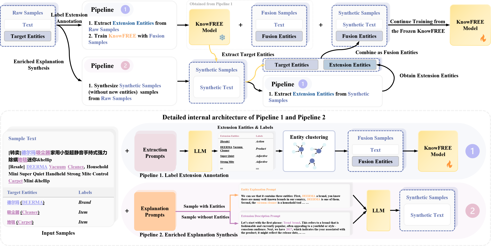
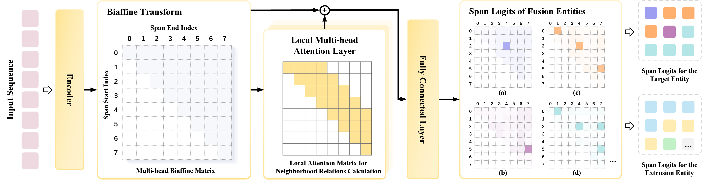

# Improving Low-Resource Sequence Labeling with Knowledge Fusion and Contextual Label Explanations



### 🌍 Overview

This repository provides the official implementation of our paper:

> **Improving Low-Resource Sequence Labeling with Knowledge Fusion and Contextual Label Explanations**
> [arXiv:2501.19093](https://arxiv.org/abs/2501.19093)

Low-resource sequence labeling often suffers from data sparsity and limited contextual generalization.
We propose **KnowFREE (Knowledge-Fused Representation Enhancement Framework)** — a framework that integrates **external linguistic knowledge** and **contextual label explanations** into the model’s representation space to enhance low-resource performance.

**Key Highlights:**

Combining an **LLM-based knowledge enhancement workflow** with a **span-based KnowFREE model** to effectively address these challenges.

**Pipeline 1: Label Extension Annotation**
* Objective: To leverage LLMs to generate extension entity labels, word segmentation tags, and POS tags for the original samples.
* Effect:
  * Enhances the model's understanding of fine-grained contextual semantics.
  * Improves the ability to distinguish entity boundaries in character-dense languages.

**Pipeline 2: Enriched Explanation Synthesis**

* Objective: Using LLMs to generate detailed, context-aware explanations for target entities, thereby synthesizing new, high-quality training samples.
* Effect:
  * Effectively mitigates semantic distribution bias between synthetic samples and the target domain.
  * Significantly expands the number of samples and improves model performance in extremely low-resource settings.


---

### 🔗 Quick Links

  - [Model Checkpoints](#♠️-model-checkpoints)
  - [Data Augmentation Workflow](#📊-data-augmentation-workflow)
  - [Train KnowFREE](#🔥-run-knowfree-models)
  - [Citation](#📚-citation)

### ♠️ Model Checkpoints

Due to the large number of experiments, the architectural differences between the initial and reconstructed models, and the limited practical value of low-resource checkpoints sampled from the full dataset, we only release a few representative checkpoints (e.g., weibo) on Hugging Face for reference, as shown below:

| Model                                                                                                                         |  F1   |
| :---------------------------------------------------------------------------------------------------------------------------- | :---: |
| [aleversn/KnowFREE-Weibo-BERT-base (Many shots 1000 with ChatGLM3)](https://huggingface.co/aleversn/KnowFREE-Weibo-BERT-base) | 76.78 |
| [aleversn/KnowFREE-Youku-BERT-base (Many shots 1000 with ChatGLM3)](https://huggingface.co/aleversn/KnowFREE-Youku-BERT-base) | 84.50 |

---

### 🧩 KnowFREE Framework



**Architecture**: A Biaffine-based span model that supports **nested entity** annotation.

**Core Innovations:**

* Introduces a **Local Multi-head Attention Layer** to efficiently fuse the multi-type extension label features generated in Pipeline 1.
* **No External Knowledge Needed for Inference:** The model learns to fuse knowledge during the training, the logits of extension labels will be masked during inference.

---

### ⚙️ Installation Guide

#### Core Dependencies

Create an environment and install dependencies:

```bash
conda create -n knowfree python=3.8
conda activate knowfree
```

```bash
pip install torch==1.8.0+cu111 torchvision==0.9.0+cu111 torchaudio==0.8.0 -f https://download.pytorch.org/whl/torch_stable.html
pip install transformers==4.18.0 fastNLP==1.0.1 PrettyTable
pip install torch-scatter==2.0.8 -f https://data.pyg.org/whl/torch-1.8.0+cu111.html
```

### 📊 Data Augmentation Workflow

See the detailed data synthesis pipeline in [Syn_Pipelines](docs/Syn_Pipelines.md).

In KnowFREE, we employ **contextual paraphrasing and label explanation synthesis** to augment low-resource datasets.
For each entity label, LLMs generate descriptive explanations that are integrated into the learning process to mitigate label semantic sparsity.

---

### 🔥 Run KnowFREE Models

#### Training with `KnowFREE`

##### Dataset Format

Specify the dataset path using the `data_present_path` argument (`Default`: `./datasets/present.json`). The file should be a JSON object with the following format:

```json
{
    "weibo": {
        "train": "./datasets/weibo/train.jsonl",
        "dev": "./datasets/weibo/dev.jsonl",
        "test": "./datasets/weibo/test.jsonl",
        "labels": "./datasets/weibo/labels.txt"
    }
}
```

**Train Samples of Different Languages:**

- Chinese

```jsonl
{"text": ["科", "技", "全", "方", "位", "资", "讯", "智", "能", "，", "快", "捷", "的", "汽", "车", "生", "活", "需", "要", "有", "三", "屏", "一", "云", "爱", "你"], "label": ["O", "O", "O", "O", "O", "O", "O", "O", "O", "O", "O", "O", "O", "O", "O", "O", "O", "O", "O", "O", "O", "O", "O", "O", "O", "O"], "entities": []}
{"text": ["对", "，", "输", "给", "一", "个", "女", "人", "，", "的", "成", "绩", "。", "失", "望"], "label": ["O", "O", "O", "O", "O", "O", "B-PER.NOM", "E-PER.NOM", "O", "O", "O", "O", "O", "O", "O"], "entities": [{"start": 6, "entity": "PER.NOM", "end": 8, "text": ["女", "人"]}]}
{"text": ["今", "天", "下", "午", "起", "来", "看", "到", "外", "面", "的", "太", "阳", "。", "。", "。", "。", "我", "第", "一", "反", "应", "竟", "然", "是", "强", "烈", "的", "想", "回", "家", "泪", "想", "我", "们", "一", "起", "在", "嘉", "鱼", "个", "时", "候", "了", "。", "。", "。", "。", "有", "好", "多", "好", "多", "的", "话", "想", "对", "你", "说", "李", "巾", "凡", "想", "要", "瘦", "瘦", "瘦", "成", "李", "帆", "我", "是", "想", "切", "开", "云", "朵", "的", "心"], "label": ["O", "O", "O", "O", "O", "O", "O", "O", "O", "O", "O", "O", "O", "O", "O", "O", "O", "O", "O", "O", "O", "O", "O", "O", "O", "O", "O", "O", "O", "O", "O", "O", "O", "O", "O", "O", "O", "O", "B-LOC.NAM", "E-LOC.NAM", "O", "O", "O", "O", "O", "O", "O", "O", "O", "O", "O", "O", "O", "O", "O", "O", "O", "O", "O", "B-PER.NAM", "I-PER.NAM", "E-PER.NAM", "O", "O", "O", "O", "O", "O", "B-PER.NAM", "E-PER.NAM", "O", "O", "O", "O", "O", "O", "O", "O", "O"], "entities": [{"start": 38, "entity": "LOC.NAM", "end": 40, "text": ["嘉", "鱼"]}, {"start": 59, "entity": "PER.NAM", "end": 62, "text": ["李", "巾", "凡"]}, {"start": 68, "entity": "PER.NAM", "end": 70, "text": ["李", "帆"]}]}
```

- English

```jsonl
{"text": ["im", "thinking", "of", "a", "comedy", "where", "a", "group", "of", "husbands", "receive", "one", "chance", "from", "their", "wives", "to", "engage", "with", "other", "women"], "entities": [{"start": 4, "end": 5, "entity": "GENRE", "text": ["comedy"]}, {"start": 6, "end": 21, "entity": "PLOT", "text": ["a", "group", "of", "husbands", "receive", "one", "chance", "from", "their", "wives", "to", "engage", "with", "other", "women"]}]}
{"text": ["another", "sequel", "of", "an", "action", "movie", "about", "drag", "street", "car", "races", "alcohol", "and", "gun", "violence"], "entities": [{"start": 1, "end": 2, "entity": "RELATIONSHIP", "text": ["sequel"]}, {"start": 4, "end": 5, "entity": "GENRE", "text": ["action"]}, {"start": 7, "end": 15, "entity": "PLOT", "text": ["drag", "street", "car", "races", "alcohol", "and", "gun", "violence"]}]}
{"text": ["what", "is", "the", "name", "of", "the", "movie", "in", "which", "a", "group", "of", "criminals", "begin", "to", "suspect", "that", "one", "of", "them", "is", "a", "police", "informant", "after", "a", "simple", "jewelery", "heist", "goes", "terribly", "wrong"], "entities": [{"start": 9, "end": 32, "entity": "PLOT", "text": ["a", "group", "of", "criminals", "begin", "to", "suspect", "that", "one", "of", "them", "is", "a", "police", "informant", "after", "a", "simple", "jewelery", "heist", "goes", "terribly", "wrong"]}]}
{"text": ["a", "movie", "with", "vin", "diesel", "in", "world", "war", "2", "in", "a", "foreign", "country", "shooting", "people"], "entities": [{"start": 3, "end": 5, "entity": "ACTOR", "text": ["vin", "diesel"]}, {"start": 6, "end": 9, "entity": "GENRE", "text": ["world", "war", "2"]}, {"start": 11, "end": 15, "entity": "PLOT", "text": ["foreign", "country", "shooting", "people"]}]}
{"text": ["what", "is", "the", "1991", "disney", "animated", "movie", "that", "featured", "angela", "lansbury", "as", "the", "voice", "of", "a", "teapot"], "entities": [{"start": 3, "end": 4, "entity": "YEAR", "text": ["1991"]}, {"start": 5, "end": 6, "entity": "GENRE", "text": ["animated"]}, {"start": 9, "end": 11, "entity": "ACTOR", "text": ["angela", "lansbury"]}, {"start": 16, "end": 17, "entity": "CHARACTER_NAME", "text": ["teapot"]}]}
```

- Japanese

```jsonl
{"text": ["I", "n", "f", "o", "r", "m", "i", "x", "の", "動", "き", "を", "み", "て", "、", "オ", "ラ", "ク", "ル", "と", "I", "B", "M", "も", "追", "随", "し", "た", "。"], "entities": [{"start": 0, "end": 8, "entity": "法人名", "text": ["I", "n", "f", "o", "r", "m", "i", "x"]}, {"start": 15, "end": 19, "entity": "法人名", "text": ["オ", "ラ", "ク", "ル"]}, {"start": 20, "end": 23, "entity": "法人名", "text": ["I", "B", "M"]}]}
{"text": ["現", "在", "は", "ア", "ニ", "メ", "ー", "シ", "ョ", "ン", "業", "界", "か", "ら", "退", "い", "て", "お", "り", "、", "水", "彩", "画", "家", "と", "し", "て", "も", "活", "動", "し", "て", "い", "る", "。"], "entities": []}
{"text": ["大", "野", "東", "イ", "ン", "タ", "ー", "チ", "ェ", "ン", "ジ", "は", "、", "大", "分", "県", "豊", "後", "大", "野", "市", "大", "野", "町", "後", "田", "に", "あ", "る", "中", "九", "州", "横", "断", "道", "路", "の", "イ", "ン", "タ", "ー", "チ", "ェ", "ン", "ジ", "で", "あ", "る", "。"], "entities": [{"start": 0, "end": 11, "entity": "施設名", "text": ["大", "野", "東", "イ", "ン", "タ", "ー", "チ", "ェ", "ン", "ジ"]}, {"start": 13, "end": 26, "entity": "地名", "text": ["大", "分", "県", "豊", "後", "大", "野", "市", "大", "野", "町", "後", "田"]}, {"start": 29, "end": 36, "entity": "施設名", "text": ["中", "九", "州", "横", "断", "道", "路"]}]}
{"text": ["2", "0", "1", "4", "年", "1", "月", "1", "5", "日", "、", "マ", "バ", "タ", "は", "ミ", "ャ", "ン", "マ", "ー", "の", "上", "座", "部", "仏", "教", "を", "擁", "護", "す", "る", "使", "命", "を", "持", "っ", "て", "、", "マ", "ン", "ダ", "レ", "ー", "の", "仏", "教", "僧", "の", "大", "規", "模", "な", "会", "議", "で", "正", "式", "に", "設", "立", "さ", "れ", "た", "。"], "entities": [{"start": 11, "end": 14, "entity": "法人名", "text": ["マ", "バ", "タ"]}, {"start": 15, "end": 20, "entity": "地名", "text": ["ミ", "ャ", "ン", "マ", "ー"]}, {"start": 38, "end": 43, "entity": "地名", "text": ["マ", "ン", "ダ", "レ", "ー"]}]}
{"text": ["永", "泰", "荘", "駅", "は", "、", "中", "華", "人", "民", "共", "和", "国", "北", "京", "市", "海", "淀", "区", "に", "位", "置", "す", "る", "北", "京", "地", "下", "鉄", "8", "号", "線", "の", "駅", "で", "あ", "る", "。"], "entities": [{"start": 0, "end": 4, "entity": "施設名", "text": ["永", "泰", "荘", "駅"]}, {"start": 6, "end": 19, "entity": "地名", "text": ["中", "華", "人", "民", "共", "和", "国", "北", "京", "市", "海", "淀", "区"]}]}
```

- Korean

```jsonl
{"text": ["그", "모습", "을", "보", "ㄴ", "민이", "는", "할아버지", "가", "마치", "전쟁터", "에서", "이기", "고", "돌아오", "ㄴ", "장군", "처럼", "의젓", "하", "아", "보이", "ㄴ다고", "생각", "하", "았", "습니다", "."], "entities": [{"start": 5, "end": 6, "entity": "PS", "text": ["민이"]}]}
{"text": ["내달", "18", "일", "부터", "내년", "2", "월", "20", "일", "까지", "는", "서울역", "에서", "무주리조트", "부근", "까지", "스키관광", "열차", "를", "운행", "하", "ㄴ다", "."], "entities": [{"start": 0, "end": 10, "entity": "DT", "text": ["내달", "18", "일", "부터", "내년", "2", "월", "20", "일", "까지"]}, {"start": 11, "end": 12, "entity": "LC", "text": ["서울역"]}, {"start": 13, "end": 14, "entity": "OG", "text": ["무주리조트"]}]}
{"text": ["호소력", "있", "고", "선동", "적", "이", "ㄴ", "주제", "를", "잡아내", "는", "데", "능하", "ㄴ", "즈윅", "이", "지만", "이", "영화", "에서", "는", "무엇", "이", "호소력", "이", "있", "을지", "결정", "하", "지", "못하", "고", "망설이", "ㄴ다", "."], "entities": [{"start": 14, "end": 15, "entity": "PS", "text": ["즈윅"]}]}
{"text": ["그래서", "세호", "는", "밤", "이", "면", "친구", "네", "집", "을", "돌아다니", "며", "아버지", "몰래", "연습", "을", "하", "았", "습니다", "."], "entities": [{"start": 1, "end": 2, "entity": "PS", "text": ["세호"]}, {"start": 3, "end": 4, "entity": "TI", "text": ["밤"]}]}
{"text": ["황씨", "는", "자신", "이", "어리", "어서", "듣", "은", "이", "이야기", "가", "어린이", "들", "에게", "소박", "하", "ㄴ", "효자", "의", "마음", "을", "전하", "아", "주", "ㄹ", "수", "있", "을", "것", "같", "아", "5", "분", "짜리", "구연동화", "로", "각색", "하", "았", "다고", "말", "하", "ㄴ다", "."], "entities": [{"start": 0, "end": 1, "entity": "PS", "text": ["황씨"]}, {"start": 31, "end": 33, "entity": "TI", "text": ["5", "분"]}]}
{"text": ["아버지", "가", "돌아가", "시", "ㄴ", "뒤", "어머니", "의", "편애", "를", "배경", "으로", "승주", "는", "집안", "에서", "만", "은", "대단", "하", "ㄴ", "권세", "를", "누리", "었", "다", "."], "entities": [{"start": 12, "end": 13, "entity": "PS", "text": ["승주"]}]}
```

**Labels**

- `.txt`

```
O
GPE.NAM
GPE.NOM
LOC.NAM
LOC.NOM
ORG.NAM
ORG.NOM
PER.NAM
PER.NOM
```

- `.json` / `.jsonl`

```json
{
    "O": {
        "idx": 0,
        "count": -1,
        "is_target": true
    },
    "GPE.NAM": {
        "idx": 1,
        "count": -1,
        "is_target": true
    },
    "GPE.NOM": {
        "idx": 2,
        "count": -1,
        "is_target": true
    },
    "LOC.NAM": {
        "idx": 3,
        "count": -1,
        "is_target": true
    },
    "LOC.NOM": {
        "idx": 4,
        "count": -1,
        "is_target": true
    },
    "ORG.NAM": {
        "idx": 5,
        "count": -1,
        "is_target": true
    },
    "ORG.NOM": {
        "idx": 6,
        "count": -1,
        "is_target": true
    },
    "PER.NAM": {
        "idx": 7,
        "count": -1,
        "is_target": true
    },
    "PER.NOM": {
        "idx": 8,
        "count": -1,
        "is_target": true
    },
    "ADJECTIVE": {
        "idx": 9,
        "count": 1008,
        "is_target": false
    },
    "ADPOSITION": {
        "idx": 10,
        "count": 41,
        "is_target": false
    },
    "ADVERB": {
        "idx": 11,
        "count": 1147,
        "is_target": false
    },
    "APP": {
        "idx": 12,
        "count": 3,
        "is_target": false
    },
    "AUXILIARY": {
        "idx": 13,
        "count": 4,
        "is_target": false
    },...
}
```

* **Model**: BERT / RoBERTa

```python
from main.trainers.knowfree_trainer import Trainer
from transformers import BertTokenizer, BertConfig

MODEL_PATH = "<MODEL_PATH>"
tokenizer = BertTokenizer.from_pretrained(MODEL_PATH)
config = BertConfig.from_pretrained(MODEL_PATH)
trainer = Trainer(tokenizer=tokenizer, config=config, from_pretrained=MODEL_PATH,
                  data_name='<DATASET_NAME>',
                  batch_size=4,
                  batch_size_eval=8,
                  task_name='<TASK_NAME>')

for i in trainer(num_epochs=120, other_lr=1e-3, weight_decay=0.01, remove_clashed=True, nested=False, eval_call_step=lambda x: x % 125 == 0):
    a = i
```

**Key Params**

- `other_lr`: the learning rate of the non-PLM part.
- `remove_clashed`: remove the label that exists overlap (only choose the label with min start position)
- `nested`: whether support nested entities, when do sequence labeling like `CMeEE`, you should set it as true and disabled `remove_clashed`.
- `eval_call_step`: determine evaluation with `x` steps, defined with a function call.

##### Evaluation Only

Comment out the training loop to evaluate directly:

```python
trainer.eval(0, is_eval=True)
```

#### Train with `CNN Nested NER`

```python
from main.trainers.cnnner_trainer import Trainer
from transformers import BertTokenizer, BertConfig

MODEL_PATH = "<MODEL_PATH>"
tokenizer = BertTokenizer.from_pretrained(MODEL_PATH)
config = BertConfig.from_pretrained(MODEL_PATH)
trainer = Trainer(tokenizer=tokenizer, config=config, from_pretrained=MODEL_PATH,
                  data_name='<DATASET_NAME>',
                  batch_size=4,
                  batch_size_eval=8,
                  task_name='<TASK_NAME>')

for i in trainer(num_epochs=120, other_lr=1e-3, weight_decay=0.01, remove_clashed=True, nested=False, eval_call_step=lambda x: x % 125 == 0):
    a = i
```

##### Prediction

```python
from main.predictor.knowfree_predictor import KnowFREEPredictor
from transformers import BertTokenizer, BertConfig

MODEL_PATH = "<MODEL_PATH>"
LABEL_FILE = '<LABEL_PATH>'
tokenizer = BertTokenizer.from_pretrained(MODEL_PATH)
config = BertConfig.from_pretrained(MODEL_PATH)
pred = KnowFREEPredictor(tokenizer=tokenizer, config=config, from_pretrained=MODEL_PATH, label_file=LABEL_FILE, batch_size=4)

for entities in pred(['叶赟葆：全球时尚财运滚滚而来钱', '我要去我要去花心花心花心耶分手大师贵仔邓超四大名捕围观话筒转发邓超贴吧微博号外话筒望周知。邓超四大名捕']):
    print(entities)
```

**Result**

```json
[
    [
        {'start': 0, 'end': 3, 'entity': 'PER.NAM', 'text': ['叶', '赟', '葆'
            ]
        }
    ],
    [
        {'start': 45, 'end': 47, 'entity': 'PER.NAM', 'text': ['邓', '超'
            ]
        },
        {'start': 19, 'end': 21, 'entity': 'PER.NAM', 'text': ['邓', '超'
            ]
        },
        {'start': 31, 'end': 33, 'entity': 'PER.NAM', 'text': ['邓', '超'
            ]
        }
    ]
]
```

### 📚 Citation
```bibtex
@inproceedings{lai-etal-2025-improving,
    title = "Improving Low-Resource Sequence Labeling with Knowledge Fusion and Contextual Label Explanations",
    author = "Lai, Peichao  and
      Gan, Jiaxin  and
      Ye, Feiyang  and
      Zhang, Wentao  and
      Fu, Fangcheng  and
      Wang, Yilei  and
      Cui, Bin",
    editor = "Christodoulopoulos, Christos  and
      Chakraborty, Tanmoy  and
      Rose, Carolyn  and
      Peng, Violet",
    booktitle = "Proceedings of the 2025 Conference on Empirical Methods in Natural Language Processing",
    month = nov,
    year = "2025",
    address = "Suzhou, China",
    publisher = "Association for Computational Linguistics",
    url = "https://aclanthology.org/2025.emnlp-main.288/",
    pages = "5666--5685",
    ISBN = "979-8-89176-332-6",
    abstract = "Sequence labeling remains a significant challenge in low-resource, domain-specific scenarios, particularly for character-dense languages. Existing methods primarily focus on enhancing model comprehension and improving data diversity to boost performance. However, these approaches still struggle with inadequate model applicability and semantic distribution biases in domain-specific contexts. To overcome these limitations, we propose a novel framework that combines an LLM-based knowledge enhancement workflow with a span-based Knowledge Fusion for Rich and Efficient Extraction (KnowFREE) model. Our workflow employs explanation prompts to generate precise contextual interpretations of target entities, effectively mitigating semantic biases and enriching the model{'}s contextual understanding. The KnowFREE model further integrates extension label features, enabling efficient nested entity extraction without relying on external knowledge during inference. Experiments on multiple domain-specific sequence labeling datasets demonstrate that our approach achieves state-of-the-art performance, effectively addressing the challenges posed by low-resource settings."
}
```
